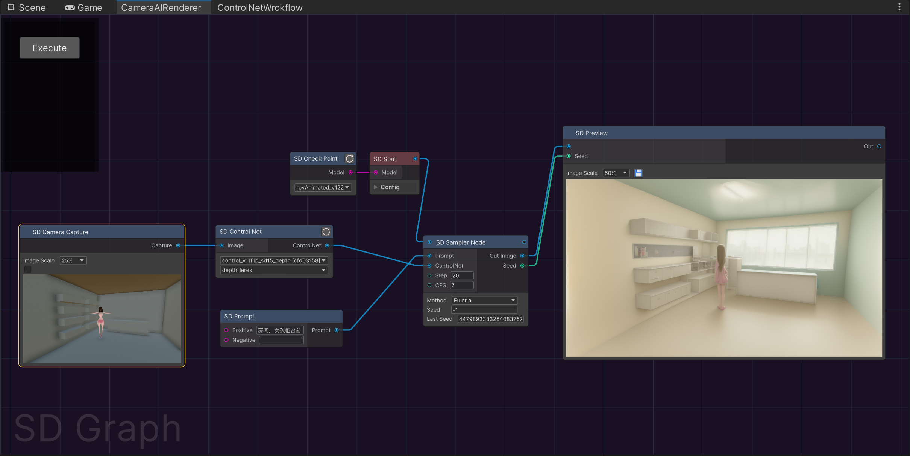

[**中文**](./README.md) | [**English**](./README_EN.md)

# AIRenderer: Unity AI渲染插件

在Unity中用节点界面的集成Stable Diffusion

结合 [AIComponent](https://github.com/aijinkela/AIComponent) 模块可以实现 AI召唤 + AI渲染，快速高效产出内容

