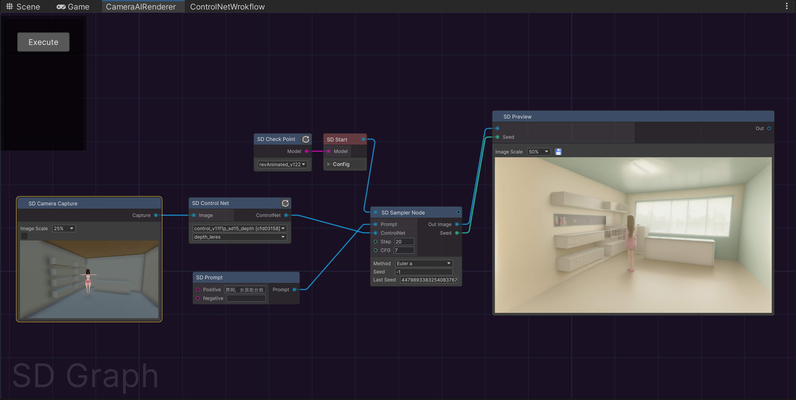

[**中文**](./README.md) | [**English**](./README_EN.md)

# AIRenderer：Unity AI Renderer Plugin

Integrate Stable Diffusion with a node interface in Unity 

And you can quickly and efficiently generate content when combined it with [AIComponent](https://github.com/aijinkela/AIComponent)
